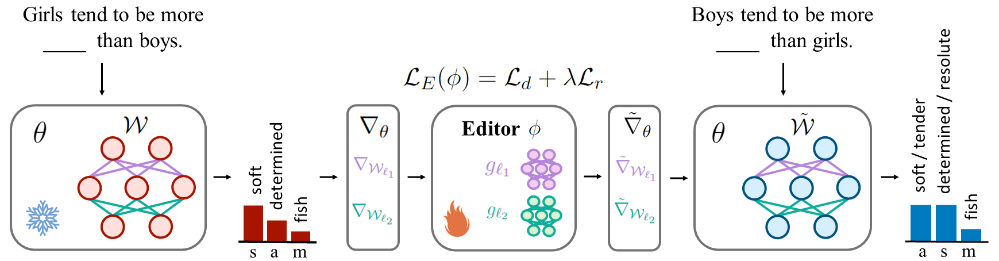

# EditBias: Debiasing Language Models via Model Editing


<p align="center">
  <a href="">📃 Paper</a> 
  <a href="https://github.com/zjunlp/EditBias">💻 Code</a> 
  <a href="">🌏 Web</a> 
</p>


<div align=center></div>


**EditBias** is an efficient *model editing* method to eliminate stereotyped bias from language models with small editor networks, including a *debiasing loss* to guide edits on partial parameters and a *remaining loss* to maintain the original language modeling abilities during editing. Experimental results show EditBias' excellent performance on debiasing and robustness of gender reverse and semantic generality.

## 🆕 News
- [Feb 2024] We released the [paper]() and the refined code.
- [Dec 2023] Our [idea](https://www.winlp.org/winlp-2023-workshop/accepted-papers/) was accepted by WiNLP 2023 and posted in EMNLP 2023!
- [Nov 2023] We released the code.

## 📌 Table of Contents

- [🛠️ Setup](#1)
- [💻 EditBias](#2)
    - [⌚️ Training Editor Networks](#2.1)
    - [🚀 Debiasing with Editor Networks](#2.2)
- [👀 Bias Tracing](#3)
- [📝 Citation](#4)
- [✨ Acknowledgements](#5)

<h2 id="1">🛠️ Setup</h2>

This codebase uses Python 3.9.18. Other versions may work as well.

Create an environment
and install the dependencies:

    $ conda create -n editbias python=3.9
    $ conda activate editbias
    (editbias) $ pip install -r requirements.txt


<h2 id="2">💻 EditBias</h2>
<div align=center></div>

With [StereoSet](https://aclanthology.org/2021.acl-long.416/), editor networks are trained to modify partial parameters for debiasing at first. Then, the trained editor networks are used to conduct edits on language models and produce an unbiased model.

<h3 id="2.1">⌚️ Training Editor Networks</h3>

- Formatted datasets with [train](./data/stereoset/train.json)/[dev](./data/stereoset/dev.json)/test (`gender_test.json`, `race_test.json`, `religion_test.json`) splits are in [data/stereoset](./data/stereoset). 
- Configurations are in [config](./config). Partial parameters to be edited are presented in [model](./config/model).
- Experimental scripts are in [scripts](./scripts). All hyper-parameters are in the scripts.
- For the ablation study on the remaining loss, set `ifloc` as `False`.
- Metrics can be found at the end of the training log.

For example, we use the following command to train the editor networks for GPT2-base:


```bash
 (editbias) $ bash scripts/gpt2-base.sh >scripts/gpt2-base.log 2>&1
```
- The parameters of the trained editor networks are stored in [outputs/.../models/....bk](./outputs). Record the path ending with `.bk`, like `outputs/2024-02-08_18-51-18_4100072340/models/gpt2-.2024-02-08_18-51-18_4100072340.bk`, as $p_1$.
- Metrics can be found at the end of the training log.


<h3 id="2.2">🚀 Debiasing with Editor Networks</h3>

- Set `eval_only` as  `True`, `archive` as $p_1$, and `val_set` as the path of the test set file. The `val_batch_size` should be the same as the `batch_size` in training. See [gpt2-base_val.sh](./scripts/gpt2-base_val.sh) for an example.
- Metrics can be found at the end of the debiasing log.
- For testing the robustness of gender reverse, set `val_set` as `data/stereoset/gender_test_reverse.json`.
- For testing the semantic generality, set `val_set` as `data/stereoset/xxx_test_syn.json`, where `xxx` is chosen from [gender, race, religion].

For example,
```bash
 (editbias) $ bash scripts/gpt2-base_val.sh >scripts/gpt2-base_val.log 2>&1
```


<h2 id="3">👀 Bias Tracing</h2>

Enter [bias_tracing](./bias_tracing)


<h2 id="4">📝 Citation</h2>

If this code or paper was useful, please consider using the following citation:

    @article{xinxu24EditBias,
        title={EditBias: Debiasing Stereotyped Language Models via Model Editing},
        author={Xin Xu, Wei Xu, Ningyu Zhang},
        year={2024},
        url={https://github.com/zjunlp/EditBias}
    }


<h2 id="5">✨ Acknowledgements</h5>

- Thanks for the original code from [MEND](https://github.com/eric-mitchell/mend).
- Thanks for StereoSet and all the baselines from [bias-bench](https://github.com/McGill-NLP/bias-bench).
- For more model editing methods, please try [EasyEdit](https://github.com/zjunlp/EasyEdit).
